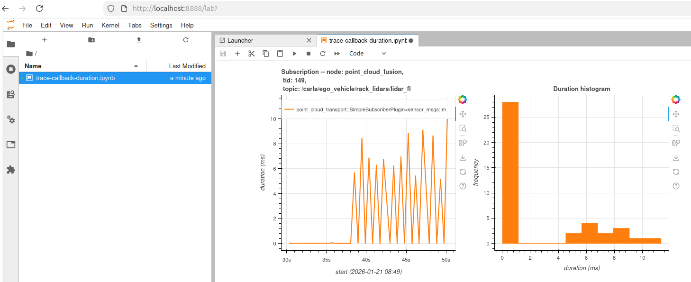
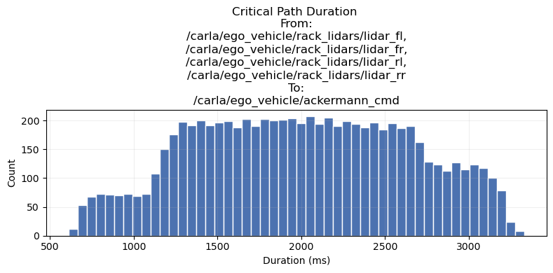
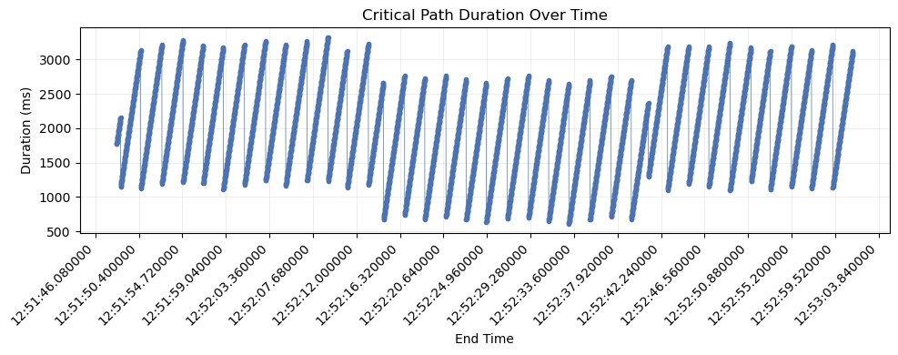
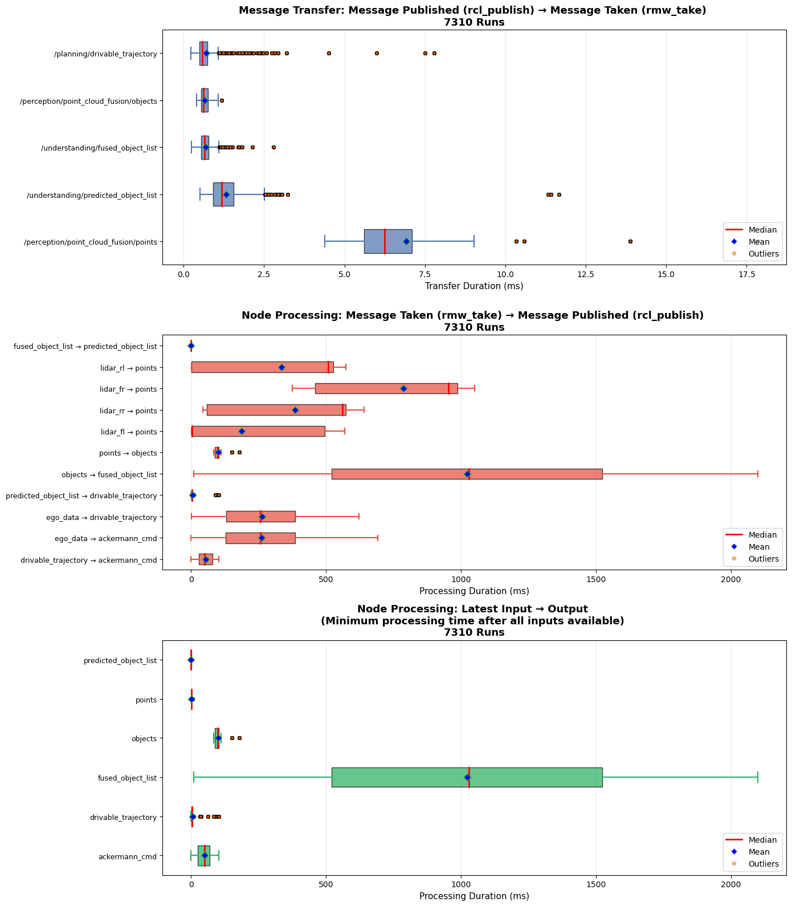
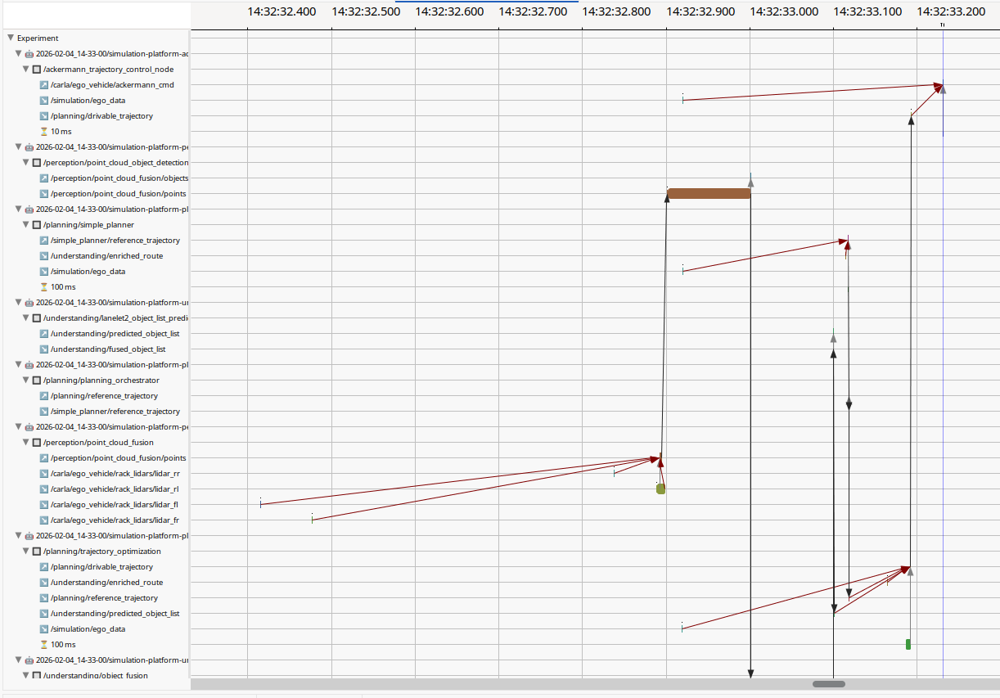

# ros2-trace-analysis

<p align="center">
  <a href="https://openads-project.github.io"></a>
  <a href="https://www.ros.org"></a>
  <a href="https://github.com/openads-project/ros2-trace-analysis/releases/latest"></a>
  <a href="https://github.com/openads-project/ros2-trace-analysis/blob/main/LICENSE"></a>
  <br>
  <a href="https://github.com/openads-project/ros2-trace-analysis/actions/workflows/docker-ros.yml"></a>
  <a href="https://openads-project.github.io/ros2-trace-analysis"></a>
  <a href="https://github.com/openads-project/ros2-trace-analysis/actions/workflows/consistency.yml"></a>
</p>

This repository contains tools for analyzing ROS 2 execution traces to understand system performance and timing behavior.

The provided Docker image allows statistical data analysis using Jupyter notebooks and graphical inspection using Eclipse Trace Compass.

<p align="center">
  <strong>🚀 <a href="#-quick-start">Quick Start</a></strong> • <strong>💻 <a href="#-development">Development</a></strong> • <strong>📝 <a href="#-documentation">Documentation</a></strong>
</p>

> [!IMPORTANT]
> This repository is part of [***OpenADS***](https://openads-project.github.io/), the *Open Automated Driving Systems* project. *OpenADS* and its modules have been initiated and are currently being maintained by the [**Institute for Automotive Engineering (ika) at RWTH Aachen University**](https://www.ika.rwth-aachen.de/de/).

## 🚀 Quick Start

Start a container mounting the folder containing trace data and using the host's network to be able to access the Jupyter Lab server. This works best using [docker-run-cli](https://pypi.org/project/docker-run-cli/):

```bash
# Execute this in the folder containing trace data
docker-run --volume $(pwd):/trace --network host ghcr.io/openads-project/ros2-trace-analysis:latest
```

### Jupyter Notebook

1. Connect to the JupyterLab server with your browser. The URL is shown in the container log, usually [http://localhost:8888](http://localhost:8888).
2. Set the `trace_dir` variable in the first cell to your trace directory
3. Run all cells to generate the visualizations
4. Analyze the plots

#### Trace Callback Durations

The [trace-callback-duration.ipynb](analysis/trace-callback-duration.ipynb) notebook provides visualization and analysis of ROS 2 callback durations from trace data. It:

- Loads trace data from a specified path
- Uses [tracetools_analysis](https://github.com/ros-tracing/tracetools_analysis) to process ROS 2 tracing events
- Generates interactive visualizations using Bokeh showing:
  - **Time series plots**: Callback duration over time for each callback
  - **Histograms**: Distribution of callback durations
  - **Combined view**: All callback durations plotted together for comparison

This helps identify performance bottlenecks, timing anomalies, and callback behavior patterns in ROS 2 applications.



#### Trace Critical Path Durations

The [trace-critical-path.ipynb](analysis/trace-critical-path.ipynb) notebook analyzes the critical path of ROS 2 message flows through callback chains. It:

- Loads trace data from a specified path
- Uses [tracetools_analysis](https://github.com/ros-tracing/tracetools_analysis) to process ROS 2 tracing events
- Identifies message flow paths from an specified end topic to specified begin topics
- Calculates end-to-end latencies across callback chains
- Generates visualizations showing:
  - **Critical path durations**: Histogram showing duration distribution and graph showing path duration over time
  - **Message Transfer Durations**: Boxplots showing the duration between a message being published and the same message being taken by a following node (per topic)
  - **Message Processing Durations**: Boxplots showing the duration between a message being taken by a node and the resulting message being published based on the input(s) (per topic).

|   |   |   |
| - | - | - |
|  |  |  |

### Eclipse Trace Compass

[Eclipse Trace Compass](https://www.eclipse.org/tracecompass/) is an open-source trace visualization and analysis tool that provides powerful features for understanding system behavior through trace data.



#### Using with ROS 2 Traces

ROS 2 uses LTTng (Linux Trace Toolkit: next generation) for tracing. Eclipse Trace Compass can directly import and visualize these traces:

1. Select `File` --> `Import ...` --> Select root directory: `/trace` --> Chack the corresponding timestamped folders per container in the list --> `Finish`
2. Extend `Tracing` in the Project Explorer --> Right-Click on `Traces` in the Project Explorer --> `Open As Experiment` --> `ROS 2 Expermient (Incubator)`
3. Extend `Experiments` in the Project Explorer --> `Experiment` --> `Views` --> `ROS 2 Messages` --> Right click on `Messages (incubator)` --> `Open`
4. Inspect the message flow, hold CTRL and scroll to zoom in, hold Shift to scroll left/right. Click an one of the bars in the message flow to follow, then click the *Follow this element* button above the graph to analyze the message flow.
5. Extend `Experiments` in the Project Explorer --> `Experiment` --> `Views` --> `ROS 2 Message Flow` --> Right click on `Message Flow (incubator)` --> `Open`
6. You should see the message flow.

### Tips

- Keep trace windows short to reduce file size.
- Restart the ROS stack before capturing a new trace session to make sure that initialization data is captured, which is required for visualization in Eclipse Trace Compass.
- Make sure that traced ROS nodes are started as `dockeruser`. Otherwise, make sure that Eclipse Trace Compass has file permissions to read the trace data.

## 💻 Development

### Set up Development Environment

1. Clone the repository.
    ```bash
    git clone https://github.com/openads-project/ros2-trace-analysis.git
    ```
1. Initialize the [`.openads-dev-environment`](https://github.com/openads-project/openads-dev-environment) submodule containing development environment configuration.
    ```bash
    cd ros2-trace-analysis
    git submodule update --init --recursive
    ```
1. Open the repository in [Visual Studio Code](https://code.visualstudio.com).
    ```bash
    code .
    ```
1. Install the recommended VS Code extensions.
    > *Ctrl+Shift+P / Extensions: Show Recommended Extensions / Install Workspace Recommended Extensions (Cloud Download Icon)*
1. Reopen the repository in a [Dev Container](https://code.visualstudio.com/docs/devcontainers/containers).
    > *Ctrl+Shift+P / Dev Containers: Rebuild and Reopen in Container*

### Build

> *Ctrl+Shift+B*

```bash
colcon build
```

### Run Tests

> *Ctrl+Shift+P / Tasks: Run Test Task*

```bash
colcon build --cmake-args -DCMAKE_EXPORT_COMPILE_COMMANDS=1
colcon test
colcon test-result --verbose
```


## 📝 Documentation

Package and node interfaces are documented in the respective package READMEs listed below. Implementation details are found in the [Source Code Documentation](https://openads-project.github.io/ros2-trace-analysis).

## ⚖️ Licensing

The source code in this repository is licensed under Apache-2.0, see [LICENSE](LICENSE). Container images provided by this repository may contain third-party software shipped with their own license terms.

## 🙏 Acknowledgements

Development and maintenance of this repository are supported by the following projects. We acknowledge the funding of the respective institutions.

| Project | Funding Institution | Grant Number |
| --- | --- | --- |
| [autotech.agil](https://www.autotechagil.de/en/) | 🇩🇪 Federal Ministry for Research, Technology and Space (BMFTR) | 01IS22088A   |

<p>
  
</p>
